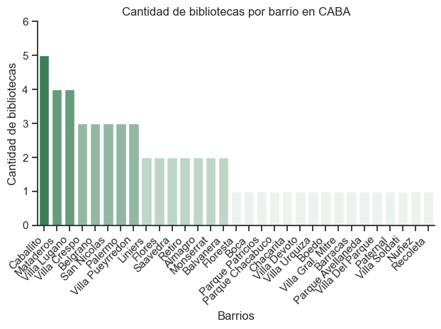

# Resumen del proyecto
Con el objetivo de poner en práctica el análisis de datos con librerías de Python, utilicé dos dataset del Gobierno de la Ciudad de Buenos Aires para conocer cuántas bibliotecas existen en cada comuna (unidades que abarcan uno o más barrios).

## Preguntas para el análisis
1. ¿Cuántas bibliotecas existen por barrio?
2. ¿Cuáles son las comunas que tienen mayor cantidad de bibliotecas?
3. ¿Cuáles son las comunas que tienen menor cantidad de bibliotecas?

# Herramientas
El análisis se desarrolló con las siguientes herramientas:
- **Python** y las siguientes librerías:
    - **Pandas:** para analizar los datos.
    - **Matplotlib:** para visualizar los datos.
    - **Seaborn:** para crear visualizaciones más detalladas.
    - **Geopandas:** para poder trabajar con datos vectoriales. Uno de los datasets tiene una columna con datos de tipo POLYGON.
    - **shapely y wkt:** el paquete shapely permite manipular objetos geométricos, y el módulo wkt se encarga de manejar geometrías en formato WKT (Well-Known Text).
- **Jupyter Notebooks:** herramienta donde ejecuté el código de Python. Permite dividir el código por secciones, incluir comentarios y gráficos, haciendo más amigable la lectura del código e interpretación del análisis.
- **Visual Studio Code:** IDE (entorno de desarrollo integrado) para ejecutar el código.
- **Git & GitHub:** para el control de versiones y compartir mi proyecto.

# Preparación de los datos
## Importar librerías
```python
import ast 
import pandas as pd
import seaborn as sns
import matplotlib.pyplot as plt
import geopandas as gpd
from shapely import wkt
```
## Cargar los datasets
En primer lugar, cargamos el csv que contiene los datos de las bibliotecas. 
```python
df = pd.read_csv('bibliotecas.csv')
```
En otro momento del análisis, importamos el csv que contiene solamente los datos de los barrios y la comuna a la que pertenecen.
```python
df_comunas = pd.read_csv('barrios_comunas.csv')
```
## Agregamos la columna de comuna al dataframe bibliotecas
```python
df_bibliotecas_comunas = df_bibliotecas.merge(df_comunas[['Barrio', 'comuna']], on='Barrio', how='left')
df_bibliotecas_comunas.head(10)
```

# Visualización gráfica de los datos
## Barplot: Cantidad de bibliotecas por barrio
El siguiente gráfico nos muestra cuántas bibliotecas existen por barrio, pero a simple vista puede resultar poco claro ya que hay muchas etiquetas en el eje x (los barrios).

A su vez, no podemos dar cuenta de la cercanía de estos barrios entre sí, por lo que tampoco podemos conocer qué zonas de la ciudad concentran la mayor cantidad de bibliotecas.




## A través de los siguientes gráficos podemos observar de manera clara cuáles comunas tienen más bibliotecas y cuáles no. 
### Barplot


## Ambos gráficos muestran la misma información: en este caso, consideré presentarlos en un mapa coroplético. Los tonos más oscuros representan las comunas que tienen mayor cantidad de bibliotecas.
### Mapa


# Insights
- Las comunas 1 y 9 son las que mayor cantidad de bibliotecas tienen, mientras que las comunas 2 y 10 son las que menor cantidad tienen.
- El barrio que más bibliotecas tiene es Caballito, con un total de 5.

# Conclusión
El proyecto me permitió profundizar mi conocimiento con las herramientas que se utilizan en el campo del análisis de datos, así como poner en práctica el pensamiento crítico para dar cuenta de qué representan los resultados obtenidos y cómo plasmarlos en visualizaciones claras.

